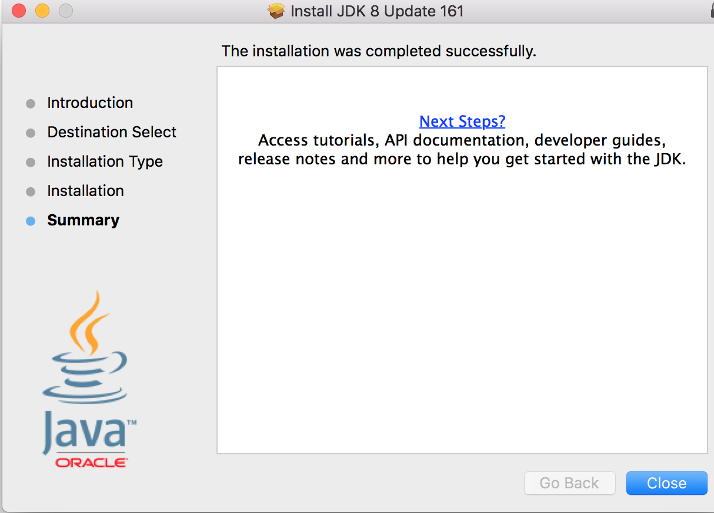

## The Java Language Specification,API,JRE,JDK,and IDE  
  
>Java syntax is defined in the Java language specification, and the Java library is defined in the Java API. 
 The JDK is the software for developing and running Java programs. An IDE is an integrated development environment for rapidly developing programs.  
 
Computer languages have strict rules of usage. If you do not follow the rules when writing a program, the computer will not be able to understand it. The Java language specification and the Java API define the Java standards.  
The Java language specification is a technical definition of the Java programming  
language’s syntax and semantics. You can find the complete Java language specification at http://docs.oracle.com/javase/specs/.  
The application program interface (API), also known as library, contains predefined 
classes and interfaces for developing Java programs. The API is still expanding. You can view and download the latest version of the Java API at http://download.java.net/java8/docs/api.  
Java is a full-fledged and powerful language that can be used in many ways. It comes in  three editions:  
- Java Standard Edition (Java SE) to develop client-side applications. The applications  can run standalone or as applets running from a Web browser.  
- Java Enterprise Edition (Java EE) to develop server-side applications, such as Java servlets, JavaServer Pages (JSP), and JavaServer Faces (JSF).  
- Java Micro Edition (Java ME) to develop applications for mobile devices, such as cell phones.  

####JRE & JDK

Do you want to run Java™ programs, or do you want to develop Java programs? If you want to run Java programs, but not develop them, download the Java Runtime Environment, or JRE™.

If you want to develop applications for Java, download the Java Development Kit, or JDK™. The JDK includes the JRE, so you do not have to download both separately.

####About program in this book
This book uses Java SE to introduce Java programming. Java SE is the foundation upon  which all other Java technology is based. There are many versions of Java SE. The latest,  Java SE 8, is used in this book. Oracle releases each version with a Java Development Toolkit  (JDK). For Java SE 8, the Java Development Toolkit is called JDK 1.8 (also known as Java 8  or JDK 8).  
The JDK consists of a set of separate programs, each invoked from a command line, for  developing and testing Java programs. Instead of using the JDK, you can use a Java development  tool (e.g.Intellij IDEA,NetBeans, Eclipse, and TextPad)—software that provides an integrated  development environment (IDE) for developing Java programs quickly. Editing, compiling,  building, debugging, and online help are integrated in one graphical user interface. You simply  enter source code in one window or open an existing file in a window, and then click a button  or menu item or press a function key to compile and run the program.

####How to install JDK on your machine(computer)
1. Go to Oracle official website of Java [here](http://www.oracle.com/technetwork/java/javase/downloads/jdk8-downloads-2133151.html)
 
 
2. Make sure you choose *Accept License Agreement*
 
 
3. Choose the right version for your machine.For me its macOS version.Then click and download will be started.
 
 
4. Open the downloaded package & double click to start installation
 

5. Click *continue* on the right corner of the panel
 

6. Click *Install* on the right corner of the panel
 

7. Installing...
 
 
8. Finished
 

9. Open *terminal console* & type `java` command if listing below shows then you have successfully installed the JDK on your machine.
 

######Video

######[How To Install JDK on MacOS]()

####Checkpoint
- What is the Java language specification?
- What does JRE stand for & What is the relationship between JRE & JDK?
- What does JDK stand for & what is the newest version of that?
- What does IDE stand for?