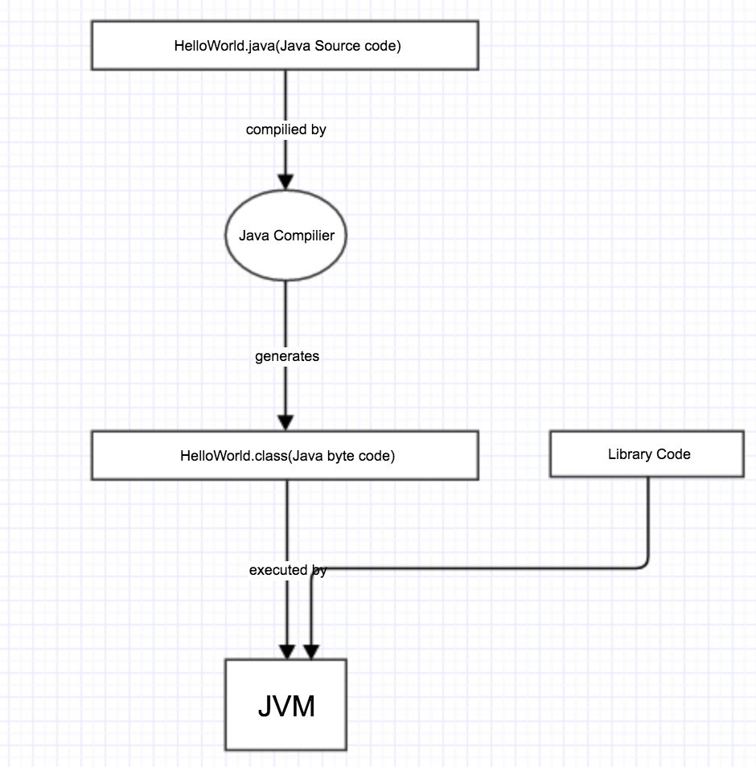
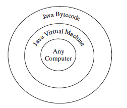
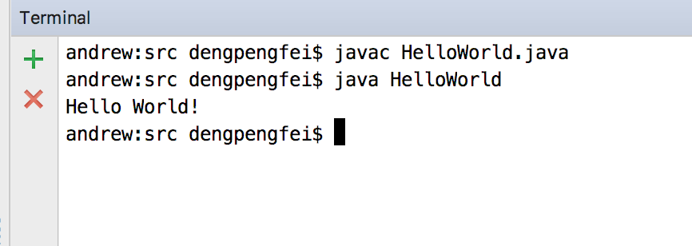

#Creating,Compiling and Executing Java Program
So far you have already know how to write your first Java program,that is *`HelloWorld.java`* but don't know how to let the machine(computer) actually run it.

Well in java programming before we really executing the program we need to compiling the source-code into byte-code first and then the byte-code can be executed by the JVM.

Picture blow demonstrate this process:

You can use any text editor or IDE to create or edit a java source-code file.Then Java compiler translates a Java source file into a Java byte-code file.In this case it translate HelloWorld.java into HelloWorld.class . Java language is a high-level language that human readable whereas byte-code is low-level language that designed for the JVM(Java Virtual Machine) to execute.The byte-code is similar to machine instructions but is architecture neutral and can run on any platform that has a JVM as shown below:

Rather than a physical machine the virtual machine is a program that interprets Java byte-code.It translates the individual instructions in the byte-code into the target machine language code one at a time rather than the whole program as a single unit. Each step is executed immediately after it is translated.The is one of the primary advantages of Java programming language:
> Write once run everywhere.

Java source-code is complied into byte-code and will be executed by the JVM alongside the code in the Library.

Below picture shows the real world example of what i mentioned before:

 

> [Compile and run a Java program](http://www.google.com/) 

- `javac` is a command provided by JVM to compile java source-code into byte-code,in this case it generate HelloWorld.class from HelloWorld.java.
- `java` is a command provided by JVM to execute byte-code (HelloWorld.class).

#####Note
> Do not use the extension *`.class`* in the command line when executing the program.Use *`java ClassName`* to run the program.

###source code
> [HellWorld.java](https://github.com/kobe73er/learn_java_programming_sourcecode/blob/master/src/chapter1/HelloWorld.java)

###checkpoint
- What is the Java source filename extension, and what is the Java byte-code filename
extension?
- What are the input and output of a Java compiler?
- What is the command to compile a Java program?
- What is the command to run a Java program?
- What is the JVM?
- Can Java run on any machine? What is needed to run Java on a computer?

