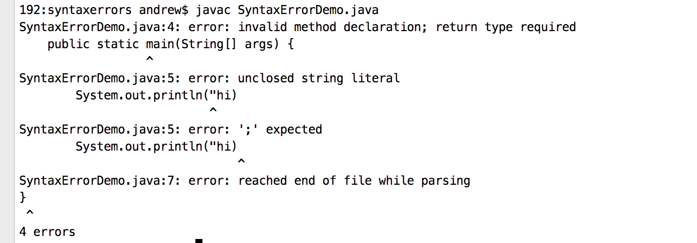

#Programming Errors
Programming errors can be categorized into three types:
- syntax errors
- runtime errors
- logic errors

##Syntax errors
In computer science, a syntax error is an error in the syntax of a sequence of 
characters or tokens that is intended to be written in a particular programming language.

For compiled languages, syntax errors are detected at compile-time.
A program will not compile until all syntax errors are corrected. 
For interpreted languages, however, a syntax error may be detected during program execution.

###Java Syntax errors
Java, like all other programming languages, has its own syntax. 
Since Java is complied language so the syntax error can be detected at compile-time.

Listing below shows some syntax errors in java programming language.
```$xslt
1 public class SyntaxErrorDemo {
2    public static main(String[] args) {
3        System.out.println("hi)
4    }
5 }
```
These lines of code has three errors:
1. missing keyword `void` before main in line 2
2. missing closing quotation in line 3
3. missing ";" in line 3

If i try to compile this program using `javac` then these errors will apprear:
 


> sourcecdoe can be checkout [here](https://github.com/kobe73er/learn_java_programming_sourcecode/blob/master/src/chapter1/syntaxerrors/SyntaxErrorDemo.java)

##Runtime Errors
A runtime error is a program error that occurs while the program is running. 
The term is often used in contrast to other types of program errors, 
such as syntax errors and compile time errors.

An example of runtime errors is division by zero. This happens when the divisor is  
zero for integer divisions. For instance, the program listing below would cause a runtime error:
```$xslt
public class RuntimeErrorDemo {
    public static void main(String[] args) {
        System.out.println(1 / 0);
    }
}
```

>objc[16390]: Class JavaLaunchHelper is implemented in both /Library/Java/JavaVirtualMachines/jdk1.8.0_144.jdk/Contents/Home/bin/java and /Library/Java/JavaVirtualMachines/jdk1.8.0_144.jdk/Contents/Home/jre/lib/libinstrument.dylib. One of the two will be used. Which one is undefined.
 Exception in thread "main" java.lang.ArithmeticException: / by zero
 	at chapter1.runtimeerror.RuntimeErrorDemo.main(RuntimeErrorDemo.java:5)
 	
##Logic Errors
Logic errors when the program does not perform the way it should be.There lots of reasons that errors happen.
For example code below shows an error:
```$xslt
   public class LogicErrorDemo {
       public static void main(String[] args) {
           System.out.println(9 / 2 + 2);
       }
   }
```

You expect this program should print 6.5 but actually it prints 6 which is wrong.
That is because in Java, the division for integers is the quotient—the fractional part is truncated.
In order to get the right answer you should change the `9 / 2` to `9.0 / 2` and the result will be 6.5

`Syntax errors` are relative easy to find since the compiler gives the indication as to where the errors came from 
and why they are wrong.

`Runtime errors` are not difficult to find to find since the location and reasons are display on the console.

`Logic errors` are kind of challenging but don't worry you will get more techniques and skills to solve that as the course continue.


#####checkpoint
1. What are syntax errors (compile errors), runtime errors, and logic errors?
2. Give examples of syntax errors, runtime errors, and logic errors.
3. If you forget to put a closing quotation mark on a string, what kind error will be raised?
4. If your program needs to read integers, but the user entered strings, an error would occur when running this program. What kind of error is this?
