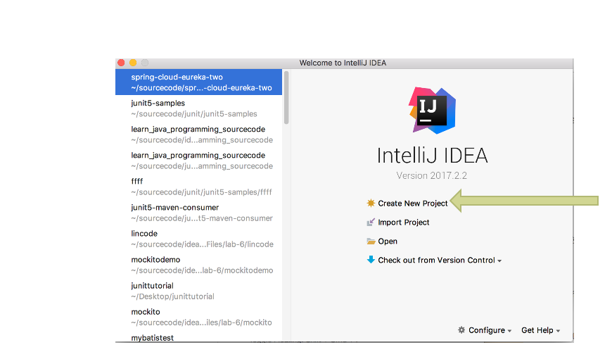
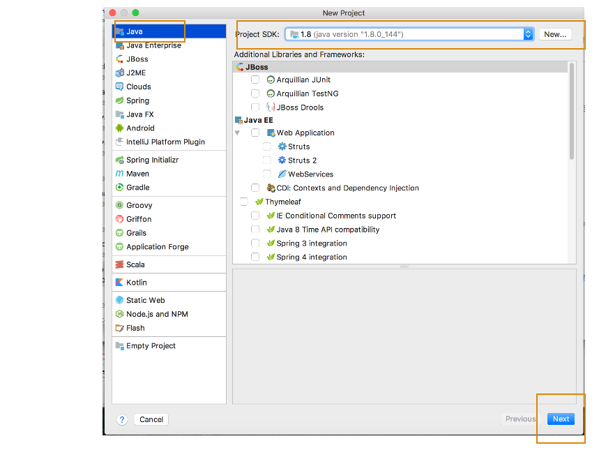
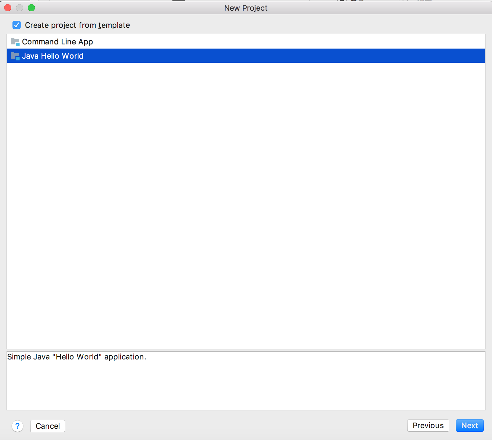
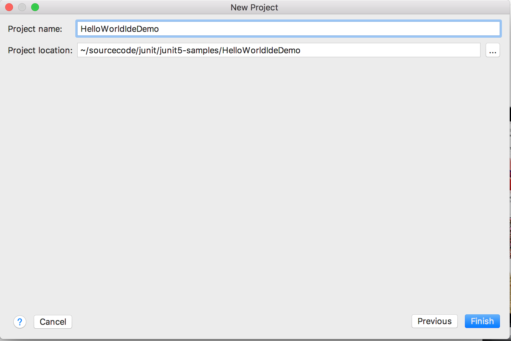
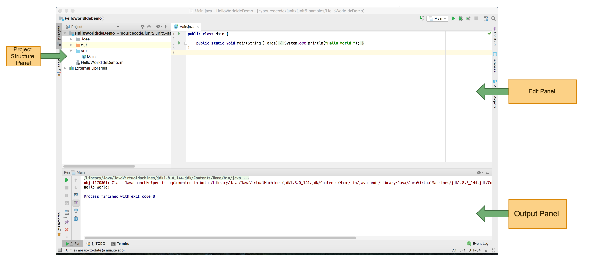

#Developing Java Program Using Intellij IDE

> You can edit,compile run and debug Java Program Using Intellij IDE.

You can download the IDE [here](https://www.jetbrains.com/idea/)

This tutorial will shows step by step approach to create a project ,create a class and compile&run 
a class in Intellij IDE.

Here are the steps to create a Java project in Intellij IDE:
1. Choose *Create New Project*
   

2. Select Java Project and JDK version select JDK8 & click next button
   

3. Choose *Create project from template* & Choose *Java Hello World* & Click *Next* button
   

4. Enter a project name you want & choose the project location & click *Finish* button on the right corner
   

5. You will see a welcome page
   

You can check the video below:

> [How to Use Intellij IDE to create a java project]()
